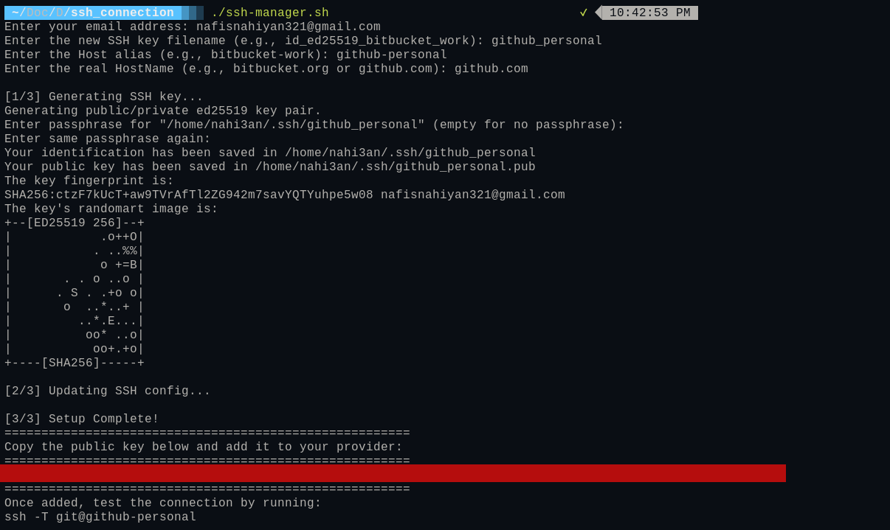

# ssh_manager
Simple script file which let user to add multilple clients ssh for git

# step to setup
1. Pull the repository 
2. Make it executable: chmod +x ssh-manager.sh
3. Run the script: ./ssh-manager.sh

# Terminal View

